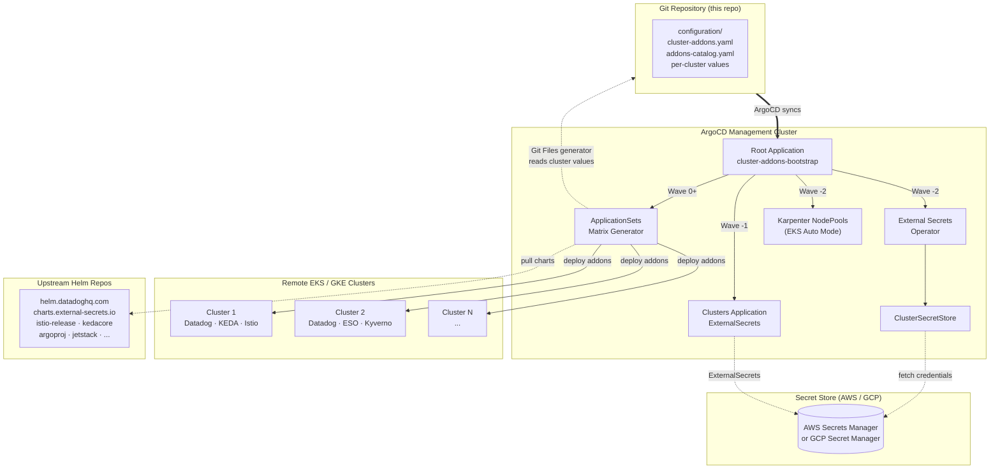

# ArgoCD Cluster Addons Management - V2

A scalable, production-grade GitOps solution for managing Kubernetes addons across multiple clusters using ArgoCD ApplicationSets, External Secrets Operator, and Helm. Supports both **AWS (EKS)** and **GCP (GKE)** clusters.

> **V2** is a complete rewrite of the [original V1 solution](#whats-new-in-v2). If you're looking for V1, see the [`v1` tag](../../tree/v1).

## Table of Contents
- [What's New in V2](#whats-new-in-v2)
- [Architecture](#architecture)
- [Directory Structure](#directory-structure)
- [Supported Addons](#supported-addons)
- [Prerequisites](#prerequisites)
- [Quick Start](#quick-start)
- [Configuration Guide](#configuration-guide)
- [How It Works](#how-it-works)
- [Advanced Features](#advanced-features)
- [Troubleshooting](#troubleshooting)
- [Release Notes](#release-notes)

## What's New in V2

V2 is an evolution of the original open-source solution, battle-tested at enterprise scale managing 50+ EKS clusters with 25+ addons. Key improvements:

| Feature | V1 | V2 |
|---------|----|----|
| **Structure** | Nested `app-of-apps/` | Flat `bootstrap/` with clear sync waves |
| **Cluster config** | Multiple files per cluster per addon | Single YAML per cluster with YAML anchors |
| **Values extraction** | Manual per-addon config files | Git Files generator (automatic per-addon extraction) |
| **Secret management** | Mixed AVP + ESO | ESO-only (AVP deprecated) |
| **Datadog deployment** | 3 separate Applications (apikey, tags, agent) | 1 multi-source Application |
| **Version overrides** | Per-environment only | Per-cluster via labels (`<addon>-version`) |
| **Node scheduling** | Not supported | EKS Auto Mode / Karpenter NodePool support |
| **Cloud providers** | AWS only | AWS (EKS) and GCP (GKE) |
| **Addons supported** | 3 (ESO, Datadog, KEDA) | 16+ (Istio, Kyverno, Argo suite, Cert Manager, etc.) |
| **Addon migration** | Not supported | Zero-downtime adoption mode (`inMigration`) |

## Architecture



### Bootstrap Flow

| Wave | Component | What it does |
|------|-----------|-------------|
| **-2** | ESO + ClusterSecretStore | Deploys External Secrets Operator to management cluster |
| **-2** | Karpenter NodePools | Creates infrastructure nodes (if `eksAutoMode: "true"`) |
| **-1** | Clusters Application | Registers remote clusters via ExternalSecrets from secret store |
| **0+** | ApplicationSets | Matrix generator (clusters + Git Files) creates per-addon Applications |

## Directory Structure

```
├── bootstrap/                          # Root Application + bootstrap templates
│   ├── root-app.yaml                   # Entry point - apply this to bootstrap
│   ├── Chart.yaml                      # Helm chart metadata
│   ├── repository-secret.yaml          # GitHub credentials template
│   └── templates/
│       ├── _helpers.tpl                # Helper functions (Datadog, ESO params)
│       ├── addons-appset.yaml          # Main ApplicationSet (data-driven)
│       ├── clusters.yaml               # Cluster registration Application
│       ├── eso.yaml                    # ESO bootstrap Application
│       └── karpenter-nodepools-appset.yaml  # NodePools for EKS Auto Mode
│
├── charts/                             # Local Helm charts
│   ├── clusters/                       # ExternalSecret per cluster
│   ├── datadog-apikey/                 # Datadog API key ExternalSecret
│   ├── eso-configuration/              # ClusterSecretStore
│   ├── karpenter-nodepools/            # Karpenter NodePool resources
│   └── .empty/                         # No-op chart for conditional paths
│
├── configuration/                      # All configuration (source of truth)
│   ├── bootstrap-config.yaml           # ESO, Git repo, region settings
│   ├── addons-catalog.yaml             # Addon definitions (repos, versions)
│   ├── cluster-addons.yaml             # Cluster registry + addon labels
│   ├── datadog-project-mappings.yaml   # Project-to-env for API key lookup
│   ├── karpenter-nodepools-config.yaml # NodePool definitions
│   ├── addons-global-values/           # Global defaults per addon
│   │   ├── <addon>.yaml                # Applied to ALL clusters
│   │   └── nodepools-config-values/    # EKS Auto Mode overrides
│   │       └── <addon>-nodepool-config.yaml
│   ├── addons-clusters-values/         # Per-cluster configurations
│   │   └── <cluster-name>.yaml         # Single file per cluster
│   └── .skip/                          # No-op path for conditional valueFiles
│
├── scripts/                            # Bootstrap automation
│   └── create-github-credentials.sh    # Bootstrap GitHub repo access
│
└── docs/                               # Documentation (optional)
```

## Addons

This solution works with **any Helm chart** — just add an entry to `configuration/addons-catalog.yaml`. The repository includes pre-configured examples for common addons:

- **Datadog** — Multi-source pattern with ExternalSecret for API key
- **KEDA** — Simple addon pattern
- **External Secrets** — Multi-source with ClusterSecretStore
- **Istio** (base, istiod, cni, ingress) — Sync-wave ordering pattern
- **Kyverno** — ServerSideApply pattern
- **Cert Manager**, **Argo Rollouts**, **External DNS** — Standard patterns

These examples demonstrate different integration patterns. Use them as templates for your own addons.

## Prerequisites

### ArgoCD Requirements
- ArgoCD >= 2.9.0 (for ApplicationSet matrix generator + multi-source apps)
- ApplicationSet controller enabled (default in ArgoCD >= 2.5)

### Cloud Provider Requirements

**AWS (EKS):**
- AWS Secrets Manager access
- IAM roles for IRSA (ESO, Datadog, KEDA, etc.)
- EKS clusters with OIDC provider configured

**GCP (GKE):**
- GCP Secret Manager access
- GCP service accounts with Workload Identity
- GKE clusters with Workload Identity enabled
- See [docs/GKE-SETUP.md](docs/GKE-SETUP.md) for full GCP setup guide

### Required Secrets in AWS Secrets Manager

**1. Cluster Credentials** (one per cluster, named `k8s-<cluster-name>`):
```json
{
  "clusterName": "my-app-dev",
  "host": "https://ABCDEF1234.gr7.eu-west-1.eks.amazonaws.com",
  "caData": "LS0tLS1CRUdJTi...",
  "accountId": "111111111111",
  "region": "eu-west-1",
  "dd_tags": "env:dev,region:eu-west-1,project:my-app"
}
```

**2. Datadog API Keys** (centralized at `datadog-api-keys-integration`):
```json
{
  "my-app-dev": "your-datadog-api-key",
  "my-app-staging": "your-datadog-api-key"
}
```

**3. GitHub Credentials** (optional, for private repos at `argocd/<management-cluster>`):
```json
{
  "github_user": "your-username",
  "github_token": "ghp_xxxxxxxxxxxx"
}
```

### IAM Policy for ESO
```json
{
  "Version": "2012-10-17",
  "Statement": [{
    "Effect": "Allow",
    "Action": [
      "secretsmanager:GetSecretValue",
      "secretsmanager:DescribeSecret"
    ],
    "Resource": [
      "arn:aws:secretsmanager:*:*:secret:k8s-*",
      "arn:aws:secretsmanager:*:*:secret:datadog-api-keys-integration*"
    ]
  }]
}
```

## Quick Start

### 1. Clone and Configure

```bash
git clone https://github.com/<your-org>/argocd-cluster-addons.git
cd argocd-cluster-addons
```

Update placeholders in these files:
- `configuration/bootstrap-config.yaml` — Set your repo URL, host cluster name, AWS region, ESO IAM role
- `bootstrap/root-app.yaml` — Set your repo URL

### 2. Create AWS Secrets
Create `k8s-<cluster-name>` secrets in AWS Secrets Manager for each cluster (see [Prerequisites](#required-secrets-in-aws-secrets-manager)).

### 3. Define Your Clusters
Edit `configuration/cluster-addons.yaml`:
```yaml
clusters:
  - name: my-cluster-dev
    labels:
      datadog: enabled
      keda: enabled
      external-secrets: enabled
```

### 4. Configure Per-Cluster Values
Create `configuration/addons-clusters-values/my-cluster-dev.yaml`:
```yaml
clusterGlobalValues:
  env: &env dev
  clusterName: &clusterName my-cluster-dev
  region: &region eu-west-1
  projectName: my-project
  accountId: 111111111111

datadog:
  datadog:
    clusterName: *clusterName

external-secrets:
  serviceAccount:
    annotations:
      eks.amazonaws.com/role-arn: "arn:aws:iam::111111111111:role/EKS-ESO-my-cluster-dev"

keda:
  serviceAccount:
    operator:
      annotations:
        eks.amazonaws.com/role-arn: "arn:aws:iam::111111111111:role/keda-my-cluster-dev"
```

### 5. Bootstrap

```bash
# For private repos: create GitHub credentials first
./scripts/create-github-credentials.sh

# Deploy the root application
kubectl apply -f bootstrap/root-app.yaml
```

### 6. Verify
```bash
kubectl get applications -n argocd
# Expected: cluster-addons-bootstrap, external-secrets-operator, clusters, <addon>-<cluster> apps
```

## Configuration Guide

### Values Precedence (lowest to highest)

1. **Helm chart defaults** — From upstream addon charts
2. **Global values** — `configuration/addons-global-values/<addon>.yaml`
3. **Cluster-specific values** — `configuration/addons-clusters-values/<cluster>.yaml`
4. **EKS Auto Mode overrides** — `nodepools-config-values/<addon>-nodepool-config.yaml` (if `eksAutoMode: "true"`)
5. **ApplicationSet parameters** — Injected by helpers (Datadog tags, ESO IRSA role)

### Adding a New Addon

1. Add to `configuration/addons-catalog.yaml`:
```yaml
applicationsets:
  - appName: my-addon
    repoURL: https://my-addon-charts.example.com
    chart: my-addon
    version: 1.0.0
    # namespace: custom-namespace  # Optional, defaults to appName
```

2. Create global defaults at `configuration/addons-global-values/my-addon.yaml`

3. Enable on clusters via labels:
```yaml
clusters:
  - name: my-cluster
    labels:
      my-addon: enabled
```

### Adding a New Cluster

1. Create AWS Secrets Manager secret `k8s-<cluster-name>`
2. Add to `configuration/cluster-addons.yaml` with desired addon labels
3. Create `configuration/addons-clusters-values/<cluster-name>.yaml`
4. Commit and push — ArgoCD handles the rest

### Per-Cluster Version Overrides
```yaml
clusters:
  - name: my-cluster
    labels:
      datadog: enabled
      datadog-version: "3.70.7"  # Override default version for this cluster only
```

## How It Works

### ApplicationSet Matrix Generator

The core pattern uses a **matrix generator** combining:
- **Cluster generator**: Discovers clusters with matching labels
- **Git Files generator**: Reads per-cluster values YAML and extracts only the relevant addon section

```yaml
generators:
  - matrix:
      generators:
        - clusters:
            selector:
              matchLabels:
                datadog: enabled
        - git:
            files:
              - path: "configuration/addons-clusters-values/{{.name}}.yaml"
```

Each addon gets only its own config section from the cluster file — no values pollution between addons.

### Multi-Source Applications

Datadog and ESO use **multi-source** Applications:
- **Source 1**: Official Helm chart from upstream repo
- **Source 2**: Local chart for supporting resources (ExternalSecret, ClusterSecretStore)
- **Source 3**: Values repo reference for `$values` paths

### YAML Anchors for DRY Configuration

Cluster values files use YAML anchors to avoid duplication:
```yaml
clusterGlobalValues:
  env: &env dev
  clusterName: &clusterName my-cluster
  region: &region eu-west-1

datadog:
  datadog:
    clusterName: *clusterName  # References "my-cluster"

keda:
  serviceAccount:
    operator:
      annotations:
        eks.amazonaws.com/role-arn: "arn:aws:iam::111111111111:role/keda-*clusterName"
```

### EKS Auto Mode / Karpenter NodePools

For clusters running EKS Auto Mode:
1. Set `eksAutoMode: "true"` label on the cluster
2. A dedicated ApplicationSet deploys Karpenter NodePools at **sync-wave -2**
3. Infrastructure nodes are created with `node-type: infrastructure` label and `infrastructure=true:NoSchedule` taint
4. Addon nodepool configs automatically add `nodeSelector` + `tolerations`

## Advanced Features

### Addon Migration (Zero-Downtime Adoption)

When migrating addons from another ArgoCD instance, set `inMigration: true` on the addon in `addons-catalog.yaml`. This injects `ignoreDifferences` rules that prevent pod restarts during adoption.

See [docs/ADDON-MIGRATION.md](docs/ADDON-MIGRATION.md) for the full step-by-step runbook.

### GKE (Google Cloud) Support

Set `bootstrap.cloudProvider: gcp` in `bootstrap-config.yaml` to switch from AWS to GCP. This changes:
- Secret store: GCP Secret Manager instead of AWS Secrets Manager
- Auth: Workload Identity instead of IRSA
- Cluster auth: `argocd-k8s-auth gcp` instead of `argocd-k8s-auth aws`

See [docs/GKE-SETUP.md](docs/GKE-SETUP.md) for the full setup guide, Terraform examples, and IAM configuration.

### Custom Sync Waves

Istio components are deployed in order: `istio-base` (-1) -> `istio-cni` (0) -> `istiod` (1) -> `istio-ingress` (2). ESO is deployed at wave -2. Customize in `addons-appset.yaml`.

## Troubleshooting

### ApplicationSet Not Generating Applications
- Verify cluster labels match addon name: `<addon>: enabled`
- Check cluster secret exists: `kubectl get secrets -n argocd -l argocd.argoproj.io/secret-type=cluster`
- Verify Git Files generator path: `configuration/addons-clusters-values/<cluster-name>.yaml` must exist

### External Secrets Failures
- Check ESO pods: `kubectl get pods -n external-secrets`
- Verify ClusterSecretStore: `kubectl get clustersecretstore global-secret-store`
- Check IAM role and IRSA configuration
- Verify AWS secret exists: `aws secretsmanager get-secret-value --secret-id k8s-<cluster-name>`

### Addon Sync Issues
- Check ArgoCD Application status in UI
- For Datadog: verify `ignoreDifferences` handles operator-generated fields
- For Kyverno: ensure `ServerSideApply=true` sync option is set
- For missing values: `ignoreMissingValueFiles: true` prevents failures

---

## Release Notes

### V2.0.0 — Complete Rewrite

**Breaking Changes from V1:**
- Directory structure completely changed (`app-of-apps/` -> `bootstrap/`, `values/` -> `configuration/`)
- ArgoCD Vault Plugin (AVP) is no longer used — replaced by ESO
- Per-cluster config is now a single file instead of per-addon files
- Root application format changed to multi-source

**New Features:**
- **Data-driven ApplicationSet** — Generic template iterates over `addons-catalog.yaml`, no hardcoded addon logic
- **Git Files generator** — Automatic per-addon value extraction from single cluster YAML
- **Multi-source Applications** — Datadog and ESO deploy supporting resources alongside main chart
- **EKS Auto Mode support** — Karpenter NodePools with infrastructure node separation
- **Helper functions** — `_helpers.tpl` extracts addon-specific logic (Datadog params, ESO IRSA, ignoreDifferences)
- **Sync wave ordering** — Ensures correct deployment order (ESO -> Clusters -> NodePools -> Addons)
- **16+ addons** — Istio full stack, Kyverno, Argo suite, Cert Manager, External DNS, and more
- **Per-cluster version overrides** — Via `<addon>-version` cluster labels
- **Migration mode** — `inMigration` flag for zero-downtime addon adoption between ArgoCD instances
- **YAML anchors** — DRY cluster configuration with shared values across addons
- **Bootstrap script** — Automated GitHub credential setup from AWS Secrets Manager

**Migration from V1:**
If upgrading from V1, you'll need to:
1. Back up your current `values/clusters.yaml` and addon configurations
2. Recreate cluster definitions in the new `configuration/cluster-addons.yaml` format
3. Consolidate per-addon value files into single per-cluster files under `configuration/addons-clusters-values/`
4. Update your root Application to point to `bootstrap/` instead of `app-of-apps/`
5. Remove AVP plugin configuration from your ArgoCD repo-server

---

## License

This project is open source. See [LICENSE](LICENSE) for details.

## Contributing

Contributions are welcome! Please open an issue or submit a pull request.
